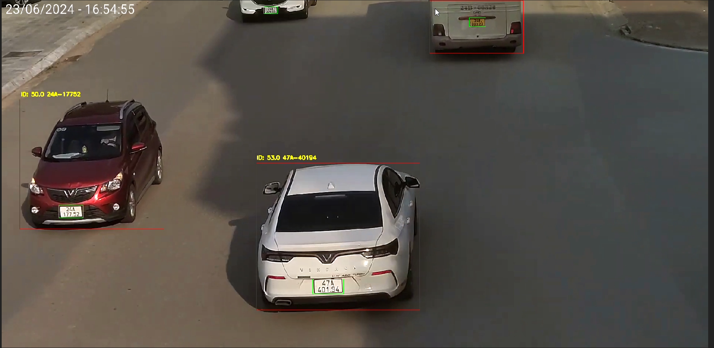

# Real-time License Plate Recognition System

Technologies: Python, OpenCV, YOLOv5, YOLOv8

---

Developed a real-time license plate recognition system using YOLOv5 for vehicle and plate detection and YOLOv5 pre-trained models for text recognition.<br>
Implemented SORT for multi-object tracking to ensure consistent license plate identification across frames.<br>
Optimized license plate reading accuracy through image preprocessing techniques (grayscale conversion, resizing, noise reduction, and image rotation).<br>
Achieved over 96% accuracy in license plate reading.


---



---

## Installation Guide

1. Clone YOLOv5 repository

```
git clone https://github.com/ultralytics/yolov5.git
cd yolov5
```
2. Download the requirements.txt from this repository
```
curl -O https://raw.githubusercontent.com/duongmanh27/Auto-Number-Plate-Recognition/main/requirements.txt
```
3. Install dependencies
```
pip install -r requirements.txt
```
