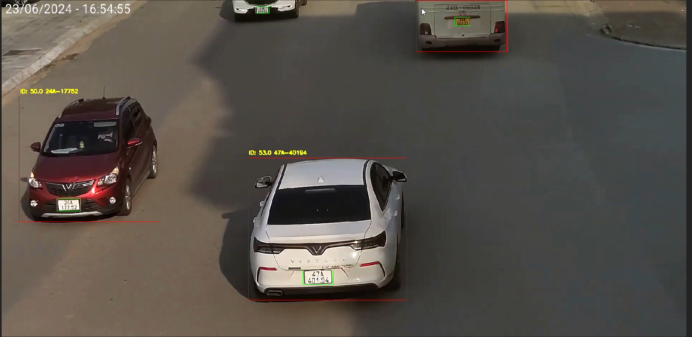

Real-time License Plate Recognition System

Technologies: Python, OpenCV, YOLOv5
Developed a real-time license plate recognition system using YOLOv5 for vehicle and plate detection and YOLOv5 pre-trained for text recognition.
Implemented SORT for multi-object tracking, ensuring consistent license plate identification across frames.
Optimized read license plate number accuracy through image preprocessing techniques (grayscale conversion, resizing, noise reduction, rotate image).

